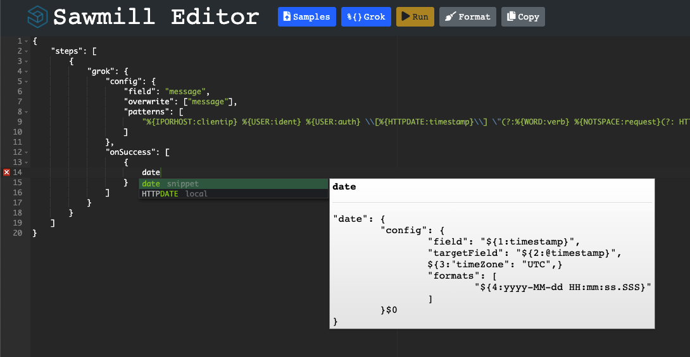

# Sawmill Editor

Create and debug your [Sawmills](https://github.com/logzio/sawmill). When you're done, send them to Logz.io support to be added to your account.

"Run" feature to come.

Editor functionality was sourced from [ace-builds](https://github.com/ajaxorg/ace-builds) and modified with snippets for writing Sawmills.



## Installation

### Run locally:

Requires [node.js](https://nodejs.org/en/)

```
git clone https://github.com/resdenia/samwill-parser-ui.git
npm install
node server.js
```

### Using Docker:

```
docker build -t sawmill-editor https://github.com/resdenia/samwill-parser-ui.git
docker run -d -p 443:3000 sawmill-editor
```
